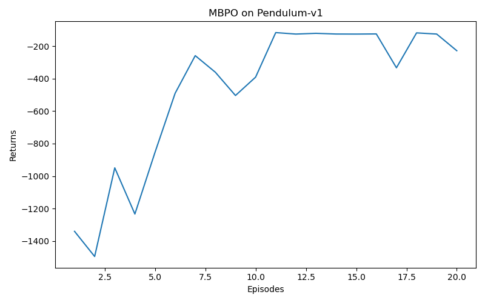

# MBPO Minimal Reproduction (Pendulum-v1)

## Overview

This is a minimal, runnable MBPO-style implementation for learning and experimentation.
It includes:

- Soft Actor-Critic (SAC) policy learning
- Ensemble dynamics model
- Short model rollouts to generate synthetic transitions
- Mixed real/model replay updates

## Installation

1. Clone the repository:
   ```bash
   git clone https://github.com/xiaoshengdianzi/MBPO_Project
   cd MBPO_Project
   ```

2. Create and activate virtual environment:
   ```bash
   python -m venv .venv
   .venv\Scripts\activate
   ```

3. Install dependencies:
   ```bash
   pip install -r requirements.txt
   ```

## Usage

### Training Command

```bash
python train_mbpo.py --device cpu --steps 120000
```

### Modular Version

```bash
python train.py --env_name Pendulum-v1 --num_episodes 20
```

### Optional Arguments

- `--rollout_horizon 1|3|5`
- `--rollout_freq 250`
- `--updates_per_step 1`
- `--eval_interval 5000`
- `--seed 42`

## Project Structure

```
06_MBPO/
│
├─ mbpo/                # Main functionality package
│   ├─ buffer.py        # Experience replay buffer (ReplayBuffer)
│   ├─ dynamics.py      # Environment dynamics model and FakeEnv
│   ├─ mbpo.py          # MBPO main workflow (training loop, model rollouts, etc.)
│   ├─ sac.py           # SAC algorithm and neural network structures
│   └─ __init__.py      # Package initialization
│
├─ train.py             # Main entry script, handles parameter parsing, training and plotting
├─ requirements.txt     # Dependency list
└─ README.md            # Project description and usage
```

### Module Descriptions

- mbpo/buffer.py: Implements ReplayBuffer for storing and sampling interaction data.
- mbpo/dynamics.py: Implements environment dynamics model (ensemble network) and FakeEnv for model rollouts to generate virtual samples.
- mbpo/sac.py: Implements SAC algorithm with policy network, Q networks and their optimizers.
- mbpo/mbpo.py: Implements MBPO main workflow, including model training, data mixing, main training loop, etc.
- train.py: Main entry point, handles parameter parsing, environment initialization, training process and result visualization.

## Results



## Expected Behavior

For `Pendulum-v1`, average return should improve over training steps.
The exact final return depends on seed and machine speed.

## Notes

- This is designed for clarity over full benchmark parity.
- To reproduce MuJoCo benchmark numbers, extend this code with:
  - uncertainty-aware model selection,
  - elite model filtering,
  - adaptive rollout horizon schedule,
  - benchmark environments and tuned hyperparameters.